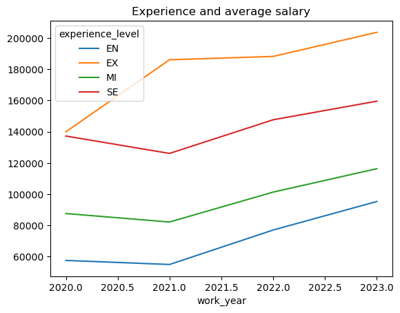
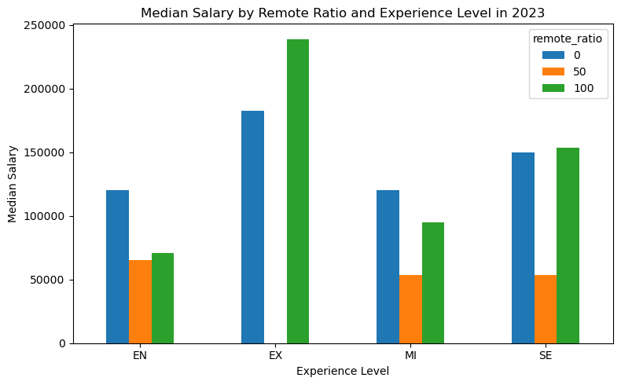
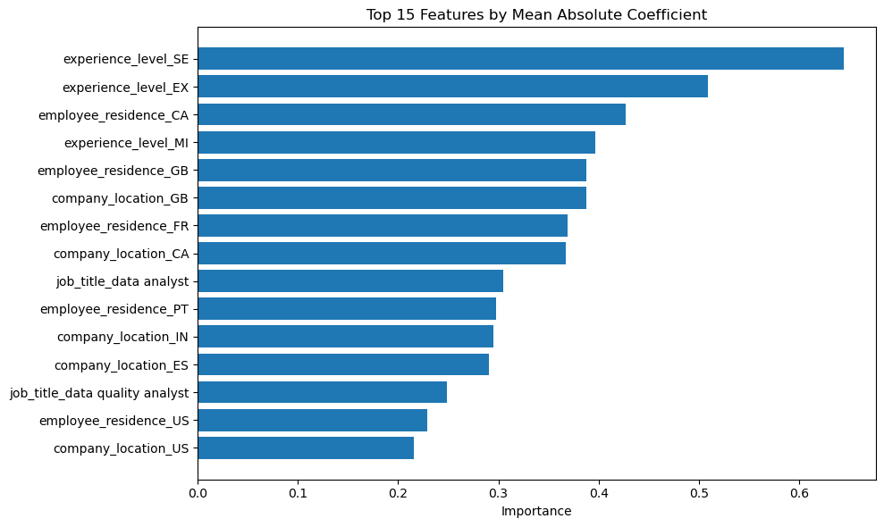

# ECE143-group-project-team14
This is the repo for group project in ECE143.

*Presentation Link*: [Video Link](https://drive.google.com/file/d/1y9QtDSKwhNIHG8sm3B82whwQQ5J2h5Yt/view?usp=drive_link)

## 0. Dataset
The dataset we chose is "Data Science Salaries 2023"
-> [[Kaggle]](https://www.kaggle.com/datasets/arnabchaki/data-science-salaries-2023)

This dataset contains 3755 rows of data science salary data from 2020~2023. Each row contains information like: *work_year, experience level, salary, and etc.*

The dataset file can be found in: `/data/ds_salaries.csv`

## 1. File Strucutre
```text
project/
│
├── data/
│   └── ds_salaries.csv
│
├── src/
│   └── salary_analysis_v2.ipynb
│
├── results/
│   ├── *.png
│
└── README.md
```
## 2. Run Code
### 2.1 Set Up Environment
For the project, we used the following modules:
- numpy
- pandas
- matplotlib
- seaborn
- sklearn

So any environment would work with those modules installed.
One example env can be:

```python
conda create -n ece143 python=3.10 pandas numpy scikit-learn matplotlib seaborn -y
```

### 2.2 Run Notebook
Log-Regression model and visualization are located in the:
`src/salary_analysis_v2.ipynb`. Make sure you select the correct python kernel, and everything should work.

## 3. Some Examples





